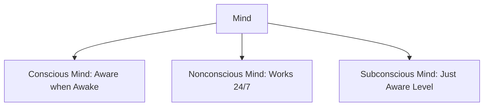
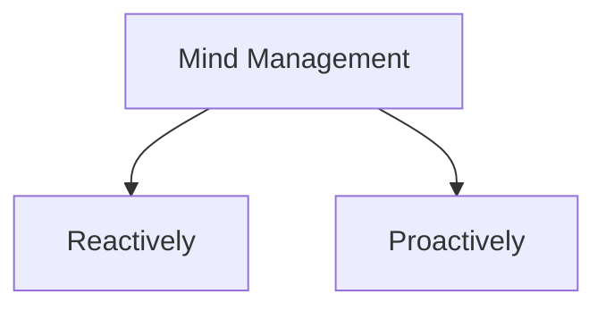

# Cleaning Up Your Mental Mess

Tagline: 5 Simple, Scientifically Proven Steps to Reduce Anxiety, Stress, and Toxic Thinking
Author: Dr. Caroline Leaf
Link: https://a.co/d/6Vozt0F
Score: ⭐️⭐️⭐️⭐️⭐️
Status: Not started
Type: Audio Book, Book
Genre: Self Help

"Cleaning Up Your Mental Mess" is a self-help book by Dr. Caroline Leaf that provides strategies for managing and improving mental well-being. The book introduces the concept of the neurocycle, a process that helps individuals address toxic thoughts, reflect, and reconceptualize for positive change. It encourages readers to acknowledge emotions, seek support, and work towards healing and personal growth. This valuable resource empowers readers to take control of their mental health journey.

# Chapter 7

Mind is divided in 3 major sections:

Mind management works in 2 methods:

- **Reactively**: Tends to be messy and you don’t actively control the response.
- **Proactively**: More Strategic and Preventative which needs active steps to clean our mind.

---

## Proactive Approach

- You need to actively work on bringing the memories from non-conscious mind to the conscious mind so you can actively modify it to get a new perspective on it.
- If the memories in conscious mind are toxic, you have the power to veto it.

# Chapter 8

- The neurocycle provides a way of accessing and directing the mind behind the mindset.
- Foundation principles of neuro cycle: *(in surgical terms)*
    1. Gather **(embrace)**: embracing the toxic thought, habit or trauma *(cutting open with the scalpel)*
    2. Reflect and Write **(processing)** are processing steps *(performing surgery)*
    3. Recheck and Active reach are **reconceptualizing** steps *(closing up and healing)*

---

**Embrace**: Embracing is accepting what has happened by understanding the signals your mind and body send you and not trying to suppress it actively. Here are a few tips to make it easier:

- Acknowledge the emotions and trauma.
- Accept that pain is inevitable and you should not be running/hiding/suppressing it.
- Know that you are not alone and can reach out to loved ones you can trust.
- Pain doesn't last forever and the sooner you learn to accept pain, the sooner can you work through it.
- When you embrace pain, your body will subconsciously start healing itself to overcome the pain.

---

**Processing**: The processing stage consists of deep reflection and writing consisting of asking the classic ‘W’ questions:

- who
- what
- when
- where
- why
- how

# Quotes

> Mind-Management when done correctly, helps facilitate talk between the consious, subconsious and non-consious mind.
>