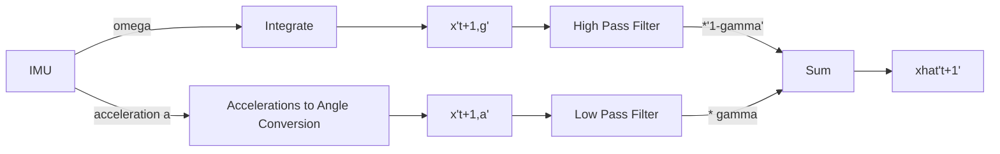

# IMU Basics and Attitude Estimation

## Key Points

- **Orientation** is also referred to as **Attitude**

## Basics of IMU

An IMU is a combination of sensors that can read:

- **Gyroscope**: Angular Velocities *ω*
- **Accelerometer**: Linear acceleration *α*
- **Magnetometer**: reads Magnetic Fields *m*

---

> A 6-DoF IMU Contains Gyroscope and Accelerometer
> 

> A 9-DoF IMU contains all three and can be called as:
> 
> - Magnetic Angular Rate and Gravity Sensor (MARG)
> - Attitude and Heading Reference System (AHRS)
> - 9-DOF IMU

---

We want to estimate

$$
\begin{bmatrix}
\phi & \theta & \psi
\end{bmatrix}^{T}_{t+1}
$$

We have

$$
\omega_{t} =
\begin{bmatrix}
\dot{\phi} & \dot{\theta} & \dot{\psi}
\end{bmatrix}^{T}_{t}
$$

We can estimate the values using numerical integration of *ωt*. But the issue is, that we need the initial values of the quadrotor so we can get the initial values to start on.

- One option can be to have an absolute sensor like Vicon which can give you a start value.
- Another option is other sensors like the Camera.
- One of the other viable assumptions you can make is that your system starts from rest and is levelled perfectly.

Thus, the estimate of values can be made as:

$$
\begin{bmatrix}
\phi\\
\theta\\
\psi
\end{bmatrix}_{t+1}
=
\begin{bmatrix}
\phi\\
\theta\\
\psi
\end{bmatrix}_{t}
+
\begin{bmatrix}
\dot{\phi}\\
\dot{\theta}\\
\dot{\psi}
\end{bmatrix}_{t}\delta{t}
$$

## Attitude Estimation from an Ideal Accelerometer

We work with an assumption that when we say roll, pitch and yaw, we are talking about Euler Angles.

We want to estimate

$$
\begin{bmatrix}
\phi & \theta & \psi
\end{bmatrix}^{T}_{t+1}
$$

We have

$$
a_{t} =
\begin{bmatrix}
a_{x} & a_{y} & a_{z}
\end{bmatrix}^{T}_{t}
$$

We can estimate this using:

$$
\phi = \tan^{-1}(\frac{a_{y}}{\sqrt{a_{x}^2 + a_{z}^2}})\\
\theta = \tan^{-1}(\frac{a_{x}}{\sqrt{a_{y}^2 + a_{z}^2}})\\
\psi = \tan^{-1}(\frac{\sqrt{a_{x}^2 + a_{y}^2}}{a_{z}})
$$

## Real-World Problems with IMU

Both the Gyroscope and Accelerometer have noise and bias!

**Bias**: They don’t read zero at rest!

**Noise**: The values don’t remain constant when the sensor
is not moving!

## Mathematical Models

### Gyroscope: Mathematical Model

*ω* = *ω̂* + *bg* + *ng*

where:

- *ω* : Measured Value
- *ω̂* : Ideal Value
- *bg* : Bias
- *ng* : White Gaussian Noise

Also, it is assumed that the derivative of bias follows gaussian distribution:

$$
\dot{b_{g}} \sim \mathcal{N} \ (0, \textbf{Q}_{g}) 
$$

Due to this, Bias will overshadow the real values (be too big) when integrating if not compensated and Noise will make values drift from real values during integration.

### Accelerometer: Mathematical Model

*a*=**WRB***T*(*â*−*g***W**) + *ba* + *na*

where:

- *a* : Measured Value $^{}{_{}}^{T}( - g^{}) $ : Ideal Value - *ba* : Bias -
*na* : White
Gaussian Noise

Also, it is assumed that derivative of bias follows gaussian
distribution:

$$
\dot{b_{a}} \sim \mathcal{N} \ (0, \textbf{Q}_{g})
$$

> Accelerometer measure net linear acceleration on the device. Values
change when device translates (not just when it rotates)
> 

Due to this, Bias will overshadow the real values (be too big) when
integrating if not compensated.

And Noise will make values drift from real values during
integration.

## Bias and Noise

**Bias** varies on device start and with external
factors such as temperature!

Can be estimated by as a function of expectation of values when the
device is at rest.

**Noise** varies with external factors such as
temperature!

Can be estimated as variances of values when device is at rest.

> Notes: The Bias and Noise change over time and need to be estimated
on the fly.
> 

### Attitude Estimation
from a Real Gyroscope

1. Estimate Bias at rest
2. Remove Bias from Initial Value (Rest)
3. Numerically Integrate

> Pros: Good for Fast Movement.
> 
> 
> Cons: Drift like crazy over time.
> 

### Attitude
Estimation from a Real Accelerometer

1. Estimate Bias at Rest
2. Remove Bias from initial value(Rest) and estimate Orientation by
decomposing the vector *a*.
    
    *t*
    
3. Low Pass Filter the values for better estimate (Because
Accelerometer Values cause a lot of errors at high speed but good for
long term integral. This will cause the filter values to lag a
bit.)

$$
  \begin{gather*}
  \hat{x_{t+1}} = (1-\gamma)\hat{x_{t}} + \gamma\tilde{x_{t+1}}\\
  \gamma \in [0,1]
  \end{gather*}
  $$

Generally, *γ* is chosen to
be a small value like 0.2

## Complementary Filter

## Resources

- **ENAE788M: Class 2 Part 2 - IMU Basics, Attitude Estimation using CF and Madgwick**
    
    [https://www.youtube.com/embed/8hRoASoBEwY?si=57a5gXdxrDgEoPRs](https://www.youtube.com/embed/8hRoASoBEwY?si=57a5gXdxrDgEoPRs)