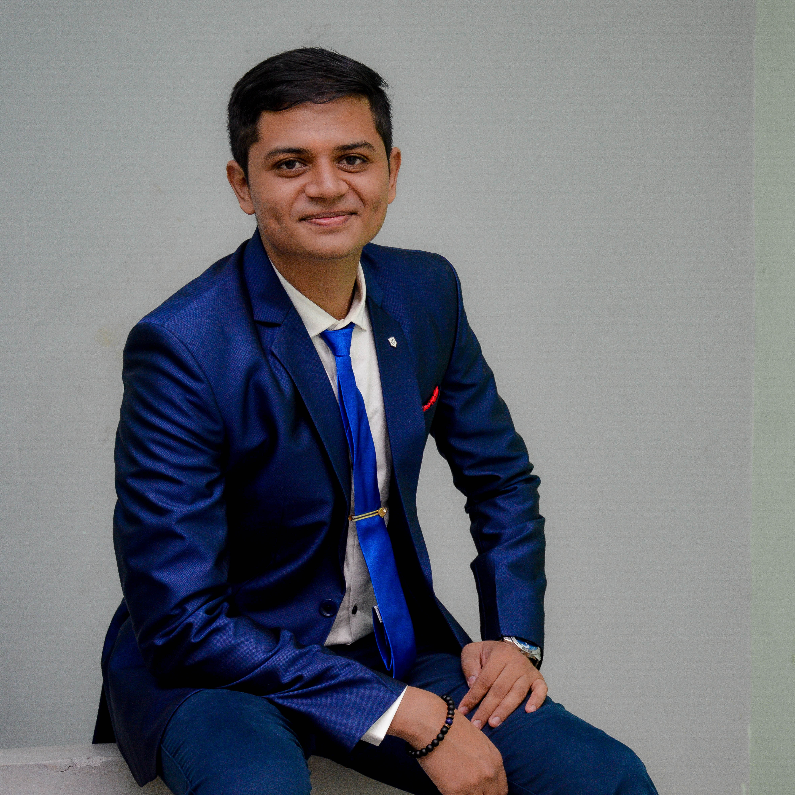
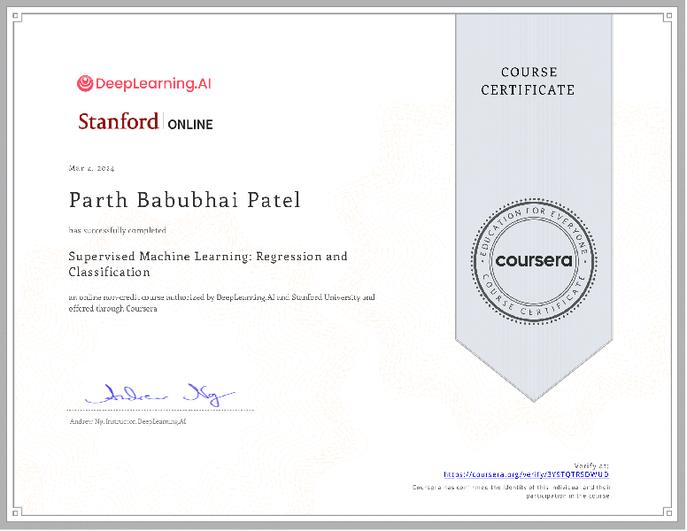
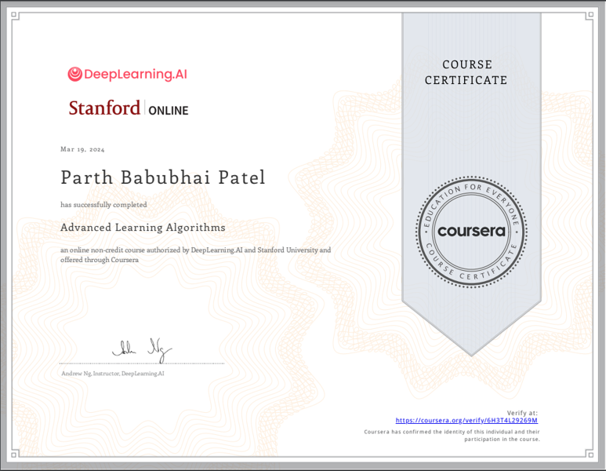

# About Me
I am a Robotics and Automation Engineer from Worcester Polytechnic Institute(Graduation in May 2024) with industry experience in Product Ideation to Market Ready since 2018 in field of Embedded Systems and Automation Systems.

# Robotics Engineer and Product Developer

> **Email**: [parth.pmech@gmail.com](mailto:parth.pmech@gmail.com)
> **Degree**: Masters in Robotics and Automation Engineering

I am a Graduate in Robotics and Automation Engineering from Worcester Polytechnic Institute with an undergraduate in Electrical Engineering from Pandit Deendayal Energy University (formerly Pandit Deendayal Petroleum University). My research interest lies in the areas of Embedded Systems, Control Systems, Robot Localization, Motion Planning and Reinforcement Learning.  
I am currently working on Sensor-Fusion of IMU, Monocular Camera and LIDAR (Visual Inertial LIDAR Odometry). I have experience in Camera Calibration, and Visual SLAM. I am actively looking for full time opportunities.  
During my masters, I worked on a fully funded and paid project with the Executive Director of Academic and Research Computing, Mr. Siamak Najafi at WPI to develop a platform to create a mobile robot platform for create easy and autonomous 3D Scans of environment for visualizing and virtual touring.  
Currently, I am working at DEKA Research and Development as a Controls Systems Engineering Intern. My responsibilities includes robust camera calibration pipeline, developing Controls Algorithm for developing Neural Nets using Supervised Learning and using computer vision based manufacturing detect testing algorithms. In my spare time I like to workout at Gym, work on automation projects, read non-fiction and watch Sitcoms!

# Resume

## Professional Experience
### Control Systems Engineer, *DEKA Research and Development*
- Improved an analytical closed-loop insulin control system by integrating multi-threading capabilities in C++ for machine learning model training, after adapting the system for Linux compatibility. This enhancement achieved a significant 96.7% reduction in runtime.
- Developed PLC systems cabinets with communication protocols like Ethernet, USB, RS-232, and RS-485 for an automated assembly line aimed at Quality Assurance for biomedical devices which improved quality identification accuracy by 18% and reduced part rejection cost by 16% per unit.
- Developed a Simulator for Type 1 Diabetic Patients to model meal-insulin response essential for developing a controller-based insulin pump using ANSI C. Ensured cross-platform compatibility, conducted unit testing, and improved data collection speeds by 840% and reduced research cycle time by 98.6%.
- Developed C++/ROS based Robust and Self Correcting tightly coupled LIDAR, Vision and IMU Based Algorithm for Autonomous Simultaneous Localization and Mapping (SLAM) for x86 Architecture with improved algorithm performance by CPU Load Balancing using Parallel Processing on Frame Data, reducing processing time by 23%
### Computational Scientist, *Worcester Polytechnic Institute*
- Developed a mobile platform framework for generating 3D Visualization Models for University Labs to construct a platform meant for Virtual tours which enabled immersive virtual tours for prospective students and individuals facing travel challenges, significantly enhancing accessibility and engagement.
- Focused on developing a framework for Camera, IMU and LIDAR-based sensor fusion for localization to implement NeRF (Neural Radiance Fields) based environment reconstruction and designing a Human-Robot Interaction platform to enhance user experience and interaction capabilities.
### Augmented Reality Developer, *Worcester Polytechnic Institute*
- I was privileged to be part of an exciting Augmented Reality (AR) project that has the potential to reshape how technicians work. Our focus was to empower technicians with hands-free data visualization.
- **Hands-Free Data Visualization**: I led the development of an AR application that allowed technicians to visualize critical data, graphs, and readings from tools like multimeter without taking their hands off their tasks.
- **User-Centric Design**: Drawing from my experience in designing seamless hardware-software compatibility for remote control integration, we ensured our AR app was intuitive and user-friendly, enabling technicians of all levels to adapt effortlessly.
- **Real-time Insights**: Helping technicians make informed decisions on the spot and significantly reducing errors.
### Embedded Systems Engineer, *Ecologic Pvt Ltd*
- Developed environmental sensory products for ATMEL Architecture MCUs following SDLC to develop modular software stack that garnered USD 40,000 in funding by addressing market needs for user friendly home safety products.
- Developed AWS IoT Core based smart automation products using FreeRTOS and C++ to set up easy and maintainable large-scale biodynamic farms which reduces labor costs by 39%.
### Embedded Systems Engineer, *Dash Dot Robotics*
- Developed an IoT-supported Smart Warehouse Inventory Management System to track inventory using MQTT enabled, and AWS connected for remote monitoring and real-time inventory tracking which reduced management time by 9% and improved labour costing by 9.4%.
- Developed the firmware in C++ based on Platform IO following the Software Development Lifecycle (SDLC) with Unit testing for ATMEL Architecture and CMake for embedded programming, deployment, and automated testing.

## Education
### M.S. Robotics & Automation Engineering
*Worcester Polytechnic Institute, Worcester, MA*
- **Foundation of Robotics:** RBE 500
- **Robot Controls:** RBE502
- **Human Robot Interaction:** RBE526
- **Motion Planning:** RBE 550
- **Soft Robotics:** RBE 530
- **Swarm Intelligence:** RBE 595
- **Robot Dynamics:** RBE501
### Extended Studies
*UC San Diego Extended Studies*
- **Advanced Digital Systems Design:** ECE 574
- **Project Management:** MIS 576
### B.Tech Electrical Engineering
*Pandit Deendayal Energy University, Gujarat, India*
### Class I - XII
*Bharatiya Vidya Bhavan's Vallabhram Mehta Public School, Gujarat, India*

## Certification
### Machine Learning Specialization
1. Supervised Machine Learning: Regression and Classification
	
2. Advanced Learning Algorithms
	